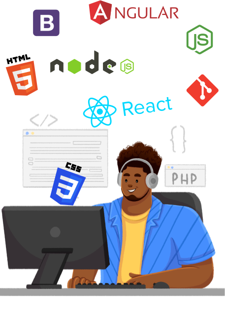

<h1>Hey !! welcome to my github profile .</h1>
  my name is Dennis Chiagozem Martins .O , in the tech world i'm called Dev-shinobi 😎 , i am a college graduate with a BSc in Computer information systems, i am also a frontend developer and an aspiring AWS certified Cloud Practitioner with the goal of becoming a fullstack developer ,  i have a passion for creating dynamic and detailed frontend user friendly interfaces , i also have a vast amount of knowledge in backend development which i am currently working on adding more skills and  knowledge in that aspect . 
  

<h2><u>Goals</u></h2>

my ultimate goal is to become a full stack developer that can work elegantly with a team of like minded developers to create beautiful and innovative web applications that provide real value to users , and to achieve this i am constantly adding more skills and information to my knowledge base and evolving .
 

<h2><u>Skills and experiences </u></h2>

 i have honed my skills in Html , css , javascript , vanilla Php and various javascript frameworks like angular , react , node.js ,  bootstrap . I am also very skilled with UI/UX designing using Figma . I spend my day time freelancing , researching , studying or coming up with new web designs and implementing them and my night time i spend completing related web developers challenges on different challenge websites as you will find on my git repositories . 

<h2><u>Hobbies</u></h2>

 When i'm not coding i some how find myself in the kitchen cooking/baking something i watched online or imagined in my head 😄  , and occasionally i enjoy playing video games [we could play 🎮 sometime]. i'm also in the habit of listening to audio books while taking long walks 
 

I am opened to new ideas and collaborations with like minded individuals that will guide me on my path to achieving my ultimate goals . My dedication and passion for being a web developer can be seen in my portfolio (git repository). 
 

 You can contact me directly via email : dennisonwuegbu@gmail.com

